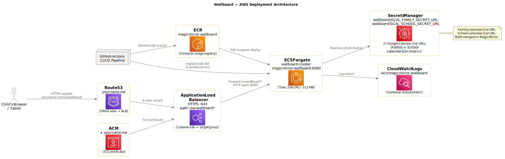
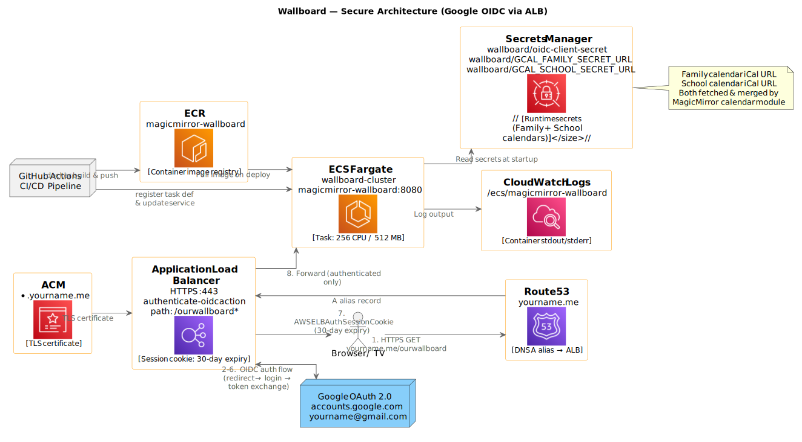

# Wallboard — Visual Daily Timetable for Kids

## Project Summary

A self-hosted visual daily timetable displayed on a tablet or TV in the house, designed to help a young child with organisation and executive functions. The board shows the day/week schedule with icons or emojis against events so it is immediately readable without needing to unlock a device or read much text.

---

## Goal

- Always-on visual schedule accessible on a wall-mounted tablet or TV screen
- Events shown with icons/emojis mapped to activity types (e.g. School, Football, Bedtime)
- No interaction required from the child — just look at it
- Self-hosted at home, not reliant on a third-party cloud service

---

## Technology Decision

### Chosen: MagicMirror² via Docker

**Why MagicMirror²:**

- Open-source, actively maintained smart mirror / dashboard framework
- Modular — swap in/out feature modules without changing the core
- Designed to run on a TV or tablet browser as a full-screen URL
- Runs as a Docker container — easy to start, stop, update, and redeploy
- Large community, good module ecosystem

**Docker image in use:** [`karsten13/magicmirror`](https://hub.docker.com/r/karsten13/magicmirror) (unofficial but well-maintained image used by this repo)

**Relevant modules for this use case:**

| Module | Purpose |
|---|---|
| `MMM-Calendar` (built-in) | Shows calendar events from iCal / Google Calendar |
| [`MMM-CalendarExt3`](https://github.com/MMRIZE/MMM-CalendarExt3) | Rich daily/weekly visual calendar view — large tiles, better for kids |

Icon/emoji mapping is done in the MagicMirror config file — keywords in event titles (e.g. `School`, `Football`) can be mapped to emojis or icons in the module configuration.

### Rejected alternatives

| Option | Reason not chosen |
|---|---|
| Fossify Calendar | Android-native app — does not run as a web page or Docker container |
| Thruday / Google Calendar on tablet | Works as a quick start but tied to Google account, less customisable for visual display |

---

## Infrastructure

### Running scenario

This repo uses the `server` scenario: MagicMirror runs headlessly in Docker and exposes a web server. The dashboard is then viewed by pointing any browser on the local network to the server's IP and port.

**Default port:** `8080`  
**URL to view the board:** `http://<your-server-ip>:8080`

### Compose setup

The Docker Compose configuration is in `run/`:

```
run/
  compose.yaml          # Main compose file (uses `include` for modular optional services)
  .env                  # Environment variables — image tags, ports, volume paths, scenario
  includes/
    base.yaml           # Core MagicMirror service definition, volume and env defaults
    labwc.yaml          # Optional: Wayland compositor (for electron/GUI scenario only)
    mmpm.yaml           # Optional: MagicMirror Package Manager web UI
    watchtower.yaml     # Optional: Auto-update container images
    no.yaml             # Stub — disables an optional include
```

Key `.env` variables:

| Variable | Default | Purpose |
|---|---|---|
| `MM_SCENARIO` | `server` | `server` (headless+web), `electron` (local GUI), `client` (remote) |
| `MM_IMAGE` | `karsten13/magicmirror:latest` | Docker image to use |
| `MM_SERVER_PORTS` | `8080:8080` | Port exposed to the local network |
| `MM_DIR` | `/opt/magic_mirror` | Path inside the container |
| `VOLUME_CONFIG` | `../../mounts/config` | Local config folder mounted into container |
| `VOLUME_MODULES` | `../../mounts/modules` | Local modules folder |
| `VOLUME_CSS` | `../../mounts/css/custom.css` | Custom CSS overrides |

Configuration and modules live in `mounts/` on the host and are bind-mounted into the container, so edits take effect without rebuilding the image.

### Known deployment issue

`compose.yaml` uses the `include:` top-level key, which requires **Docker Compose v2.20.0+** (bundled with **Docker Desktop 4.22.0+**).

Running an older version gives:
```
validating compose.yaml: (root) Additional property include is not allowed
```

**Fix:** Update Docker Desktop. As of this writing the current release is 4.64.0, which includes a compatible Compose version.

---

## Configuration — MagicMirror

MagicMirror is configured via `mounts/config/config.js`. Key sections for the wallboard use case:

### Calendar module (built-in)

```js
{
    module: "calendar",
    header: "Family Schedule",
    position: "top_left",
    config: {
        calendars: [
            {
                symbol: "calendar-alt",
                color: "#5B89C8",
                url: "https://calendar.google.com/calendar/ical/<calendar-id>/private-<secret-token>/basic.ics"
            }
        ]
    }
}
```

**Important — use the Secret address, not the Public address.**

Google Calendar exposes two iCal URLs in calendar Settings:

| URL type | Path segment | Works for private calendars? |
|---|---|---|
| Public address | `/public/basic.ics` | **No** — returns empty unless calendar is set to "Make available to public" |
| **Secret address** | `/private-<token>/basic.ics` | **Yes** — use this one |

To find the Secret address: Google Calendar → calendar ⋮ menu → **Settings** → scroll to **"Secret address in iCal format"**.

**Security:** The secret iCal URL is a capability URL — anyone with it can read the calendar. Do **not** hardcode it in files committed to GitHub. Pass it via environment variable instead:

```js
url: process.env.GCAL_SECRET_URL
```

### Secret management

| Context | Where to store `GCAL_SECRET_URL` |
|---|---|
| **GitHub Actions** | Repository secret: `Settings → Secrets and variables → Actions → New repository secret` → name: `GCAL_SECRET_URL` |
| **Local development/testing** | Add to `~/.profile` (or `~/.zshrc`): `export GCAL_SECRET_URL="https://..."` |
| **Runtime (Docker)** | Injected automatically — see below |

**Already gitignored** (no action needed):
- `mounts/` — contains `config/config.js`
- `run/.env` — Docker Compose environment file

### Injecting the secret at runtime

In `run/.env`, reference the environment variable (shell substitution at compose startup):

```
GCAL_SECRET_URL=${GCAL_SECRET_URL}
```

Then expose it to the container in `run/includes/base.yaml` under the service `environment` block:

```yaml
environment:
  - GCAL_SECRET_URL
```

For a GitHub Actions deployment workflow, inject it from the repository secret:

```yaml
- name: Deploy
  env:
    GCAL_SECRET_URL: ${{ secrets.GCAL_SECRET_URL }}
  run: docker compose -f run/compose.yaml up -d
```

### Emoji/icon mapping

Keywords in the event title in Google Calendar are matched and the corresponding emoji shown. Defined in `mounts/config/config.js` under `customEvents`:

```js
customEvents: [
    { keyword: "School",        symbol: "🏫" },
    { keyword: "Football",      symbol: "⚽" },
    { keyword: "Swimming",      symbol: "🏊" },
    { keyword: "Dinner",        symbol: "🍽️" },
    { keyword: "Bedtime",       symbol: "🌙" },
    { keyword: "Park",          symbol: "🌳" },
    { keyword: "Sewing",        symbol: "🧵" },
    { keyword: "Homework",      symbol: "📚" },
    { keyword: "Dentist",       symbol: "🦷" },
    { keyword: "Orthodontist",  symbol: "🦷" },
    { keyword: "Doctor",        symbol: "🩺" },
    { keyword: "Dr",            symbol: "🩺" },
    { keyword: "Breakfast",     symbol: "🥣" },
    { keyword: "Exercise",      symbol: "🏃" },
    { keyword: "Playdate",      symbol: "🎮" }
]
```

When migrating to `MMM-CalendarExt3` the same keywords transfer to its `symbolClass` mapping.

---

## AWS Cloud Deployment

For a permanently accessible hosted version at `https://yourname.me/ourwallboard`, the wallboard can be deployed to **AWS ECS Fargate** with HTTPS via an Application Load Balancer.

### Architecture

```
Browser → Route 53 (yourname.me) → ALB (HTTPS :443, ACM cert)
                                      └─ Listener rule: /ourwallboard*
                                           └─ Target Group → ECS Fargate task
                                                              (magicmirror-wallboard:8080)
```



| Component | AWS Service | Notes |
|---|---|---|
| Container registry | ECR | `magicmirror-wallboard` repository |
| Container runtime | ECS Fargate | `wallboard-cluster` / `magicmirror-wallboard` service |
| HTTPS / routing | ALB | Path rule `/ourwallboard*` → target group |
| TLS certificate | ACM | Cert for `yourname.me` (or `*.yourname.me`) |
| DNS | Route 53 | A alias record → ALB DNS name |
| Runtime secret | Secrets Manager | `wallboard/GCAL_SECRET_URL` |
| Logs | CloudWatch Logs | Log group `/ecs/magicmirror-wallboard` |

### Pre-requisites (one-time manual setup)

1. **VPC** — default VPC with public subnets is sufficient for a personal project
2. **ECR repository**
   ```bash
   aws ecr create-repository --repository-name magicmirror-wallboard --region <REGION>
   ```
3. **ECS Cluster**
   ```bash
   aws ecs create-cluster --cluster-name wallboard-cluster
   ```
4. **ACM certificate** — request in the AWS Console for `yourname.me` (DNS validation via Route 53)
5. **Application Load Balancer** — create via Console or CLI:
   - HTTPS listener on port 443 using the ACM cert
   - Listener rule: path `/ourwallboard*` → forward to target group
   - Target group: IP mode, port 8080, health check path `/ourwallboard/`
6. **Route 53 A record** — alias pointing `yourname.me` (or a subdomain) → ALB DNS name
7. **AWS Secrets Manager secret**
   ```bash
   aws secretsmanager create-secret \
     --name wallboard/GCAL_SECRET_URL \
     --secret-string "<your-gcal-secret-ical-url>"
   ```
8. **Security Group** — allow inbound 8080 from the ALB security group only; ALB allows 443 from `0.0.0.0/0`
9. **CloudWatch Log group**
   ```bash
   aws logs create-log-group --log-group-name /ecs/magicmirror-wallboard
   ```
10. **ECS Task Execution Role** (`ecsTaskExecutionRole`) — attach managed policy `AmazonECSTaskExecutionRolePolicy` plus the custom policy below
11. **ECS Task Role** (`ecsTaskRole`) — can be a minimal role with no policies unless additional AWS services are needed

### IAM Permissions

#### GitHub Actions deploy user (minimum)

```json
{
  "Version": "2012-10-17",
  "Statement": [
    {
      "Sid": "ECRPush",
      "Effect": "Allow",
      "Action": [
        "ecr:GetAuthorizationToken",
        "ecr:BatchCheckLayerAvailability",
        "ecr:InitiateLayerUpload",
        "ecr:UploadLayerPart",
        "ecr:CompleteLayerUpload",
        "ecr:PutImage"
      ],
      "Resource": "arn:aws:ecr:<REGION>:<ACCOUNT_ID>:repository/magicmirror-wallboard"
    },
    {
      "Sid": "ECRAuth",
      "Effect": "Allow",
      "Action": "ecr:GetAuthorizationToken",
      "Resource": "*"
    },
    {
      "Sid": "ECSDeployTasks",
      "Effect": "Allow",
      "Action": [
        "ecs:RegisterTaskDefinition",
        "ecs:DescribeTaskDefinition",
        "ecs:UpdateService",
        "ecs:DescribeServices"
      ],
      "Resource": "*"
    },
    {
      "Sid": "PassExecutionRole",
      "Effect": "Allow",
      "Action": "iam:PassRole",
      "Resource": [
        "arn:aws:iam::<ACCOUNT_ID>:role/ecsTaskExecutionRole",
        "arn:aws:iam::<ACCOUNT_ID>:role/ecsTaskRole"
      ]
    }
  ]
}
```

#### ECS Task Execution Role — extra policy for Secrets Manager

```json
{
  "Version": "2012-10-17",
  "Statement": [
    {
      "Sid": "ReadWallboardSecrets",
      "Effect": "Allow",
      "Action": "secretsmanager:GetSecretValue",
      "Resource": "arn:aws:secretsmanager:<REGION>:<ACCOUNT_ID>:secret:wallboard/*"
    }
  ]
}
```

### Pre-requisite for Deployment / Github Configuration

Before running the setup workflow and setting the Env variables in Github Actions you need to, create the OAuth 2.0 credentials in `Google Cloud Console → APIs & Services → Credentials → OAuth 2.0 Client ID (Web application)`, with redirect URI https://yourname.me/oauth2/idpresponse, then add the Client ID/Secret as the repository variable/secre


### GitHub Actions / PROD environment secrets required

| Secret / Variable | Where to set | Value |
|---|---|---|
| `AWS_ACCESS_KEY_ID` | PROD environment secret | IAM deploy user access key |
| `AWS_SECRET_KEY` | PROD environment secret | IAM deploy user secret key |
| `GCAL_SECRET_URL` | PROD environment secret | Primary Google Calendar secret iCal URL |
| `GCAL_NP_SECRET_URL` | PROD environment secret | Secondary Google Calendar secret iCal URL |
| `OPENWEATHER_API_KEY` | PROD environment secret | OpenWeatherMap API key — get one free at [openweathermap.org/api](https://openweathermap.org/api) |
| `GOOGLE_OAUTH_CLIENT_SECRET` | PROD environment secret | Google OAuth 2.0 client secret (from Google Cloud Console) |
| `AWS_DEFAULT_REGION` | PROD environment **variable** | e.g. `eu-west-1` |
| `GOOGLE_OAUTH_CLIENT_ID` | PROD environment **variable** | Google OAuth 2.0 client ID (from Google Cloud Console) |
| `GOOGLE_ALLOWED_EMAIL` | PROD environment **variable** | `yourname@gmail.com` — documented allowed identity |
| `ECS_SUBNET_IDS` | PROD environment **variable** | Comma-separated subnet IDs — output by setup workflow |
| `ECS_SECURITY_GROUP_ID` | PROD environment **variable** | ECS security group ID (`wallboard-ecs-sg`) — output by setup workflow |
| `ECS_TARGET_GROUP_ARN` | PROD environment **variable** | Target group ARN — output by setup workflow |


### Deployment files

```
infrastructure/
  Dockerfile            # Custom image: karsten13/magicmirror + config + MMM-CalendarExt3
  config.js             # AWS-specific config (basePath: /ourwallboard/), no secrets
  custom.css            # CSS overrides baked into the image
  task-definition.json  # ECS task definition template (replace <ACCOUNT_ID>/<REGION>)
.github/
  workflows/
    setup-aws-infrastructure.yml  # One-time setup: ECR, ECS cluster, ALB, ACM, Route 53, IAM, SGs
    deploy-aws.yml                # CI/CD: build → push ECR → deploy ECS on push to master
```

The setup workflow is triggered manually via `workflow_dispatch` and is idempotent — safe to re-run.
It requires `vpc_id`, `subnet_ids` (min 2 AZs), `hosted_zone_id`, and optionally `domain` as inputs.
At the end it prints the resource IDs and ARNs needed for the repository variables above.

The deploy workflow triggers on any push to `master` that touches `infrastructure/`. It can also be triggered manually via `workflow_dispatch`.

### task-definition.json placeholders to replace

Before first deploy, update `infrastructure/task-definition.json`:
- `<ACCOUNT_ID>` → your 12-digit AWS account ID
- `<REGION>` → your AWS region (e.g. `eu-west-1`)

---

## Secure Architecture — Google OIDC via ALB

Because `https://yourname.me/ourwallboard` is publicly reachable and displays a private family calendar, access should be restricted to a known Google identity before the page is served.

### Chosen approach: ALB built-in OIDC authentication

AWS Application Load Balancer supports an `authenticate-oidc` listener rule action natively — no code changes to MagicMirror are needed. The ALB handles the entire OAuth 2.0 / OIDC flow and only forwards requests to ECS once the user is authenticated. A signed session cookie (`AWSELBAuthSessionCookie`) is set in the browser with a **30-day expiry**, so a TV or tablet only needs to authenticate once a month.

**Auth flow:**

```
Browser → ALB → (no valid session cookie?)
              → 302 redirect to accounts.google.com/o/oauth2/auth
              → User logs in as yourname@gmail.com
              → Google redirects back to ALB /oauth2/idpresponse
              → ALB exchanges code for ID token, validates email claim
              → Sets AWSELBAuthSessionCookie (30 days)
              → Forwards request to ECS Fargate (MagicMirror)
```



### What changes vs. the basic architecture

| | Basic | Secure (OIDC) |
|---|---|---|
| ALB listener action | Forward → Target Group | **authenticate-oidc** → Forward → Target Group |
| Google OAuth app | Not needed | Required (Google Cloud Console) |
| Extra secret | — | `wallboard/oidc-client-secret` in Secrets Manager |
| Session re-auth | Never (open) | Every **30 days** |
| `email` claim check | — | Whitelist `yourname@gmail.com` via `AuthenticateOidcConfig.AuthenticationRequestExtraParams` or post-auth condition |

### One-time setup: Google OAuth 2.0 credentials

1. Go to [Google Cloud Console](https://console.cloud.google.com/) → **APIs & Services → OAuth consent screen**
2. User type: **External** → **Create**
3. Fill in app name (`wallboard-alb`), support email, developer email → **Save and Continue** through Scopes
4. Under **Test users** → **Add users** — add the Gmail addresses for each person who should have access (e.g. 3 separate people)
5. Leave the app in **Testing** status — **do not publish**. Only the listed test users can log in. Google does not require app verification for testing mode.
6. Go to **APIs & Services → Credentials** → **Create credentials → OAuth 2.0 Client ID**
7. Application type: **Web application**, name: `wallboard-alb`
8. **Authorised redirect URIs** — add:
   ```
   https://yourname.me/oauth2/idpresponse
   ```
9. Click **Create** — note the **Client ID** and **Client Secret**
10. Store the client secret in AWS Secrets Manager:
    ```bash
    aws secretsmanager create-secret \
      --name wallboard/oidc-client-secret \
      --secret-string "<your-google-client-secret>"
    ```

### ALB listener rule — authenticate-oidc action (AWS Console / CLI)

When creating or editing the HTTPS listener rule for `/ourwallboard*`, set the **first action** to `authenticate-oidc` with these values:

| Field | Value |
|---|---|
| Issuer | `https://accounts.google.com` |
| Authorization endpoint | `https://accounts.google.com/o/oauth2/v2/auth` |
| Token endpoint | `https://oauth2.googleapis.com/token` |
| User info endpoint | `https://openidconnect.googleapis.com/v1/userinfo` |
| Client ID | *(from Google Cloud Console)* |
| Client secret | *(ARN of `wallboard/oidc-client-secret` in Secrets Manager)* |
| Scope | `openid email` |
| Session timeout | `2592000` *(30 days in seconds)* |
| On unauthenticated request | `authenticate` *(redirect to Google login)* |

The **second action** remains: Forward → wallboard target group.

### Restricting to specific Google accounts (up to 100)

The ALB `authenticate-oidc` action verifies the Google token is valid but does **not** natively filter by email. The cleanest way to restrict access to specific consumer Gmail accounts (no Google Workspace needed) is the **OAuth Testing mode** approach:

- Keep the Google OAuth app in **Testing** status (never publish it)
- In Google Cloud Console → **OAuth consent screen → Test users**, add each allowed Gmail address
- Google will **only allow those exact email addresses** to complete the OIDC flow — anyone else sees an error page at Google, before they even reach your ALB
- You can add up to **100 test users** — plenty for a family wallboard
- The app stays in testing mode indefinitely with no expiry or verification needed

### Additional pre-requisite for secure deployment

Add to the [Pre-requisites](#pre-requisites-one-time-manual-setup) list:

12. **Google OAuth credentials** — create Web application credentials in Google Cloud Console; add `https://yourname.me/oauth2/idpresponse` as an authorised redirect URI
13. **Store OIDC client secret** in Secrets Manager as `wallboard/oidc-client-secret`
14. **Update ALB listener rule** — change action from `Forward` to `authenticate-oidc → Forward` with `sessionTimeout: 2592000`
15. **Grant ECS Task Execution Role** read access to `wallboard/oidc-client-secret` (already covered by the `wallboard/*` Secrets Manager policy above)

---

## To Do / Next Steps

- [x] Update Docker Desktop to 4.22.0+
- [x] Enable MMPM (`MM_MMPM="mmpm"` in `run/.env`)
- [x] Wire `GCAL_SECRET_URL` through compose into container
- [ ] Start stack locally: `cd run && docker compose up -d`
- [ ] Use MMPM at `http://localhost:7890` to install `MMM-CalendarExt3`
- [ ] Verify wallboard at `http://localhost:8080` shows calendar events
- [ ] Set `MM_INIT="no"` in `run/.env` after first successful start
- [ ] Mount the tablet on the wall; set browser to kiosk / always-on mode
- [ ] **AWS pre-requisites**: ECR repo, ECS cluster, ALB, ACM cert, Route 53 record, Secrets Manager secret
- [ ] Replace `<ACCOUNT_ID>` and `<REGION>` in `infrastructure/task-definition.json`
- [ ] Add `AWS_ACCESS_KEY_ID`, `AWS_SECRET_ACCESS_KEY`, `AWS_REGION` to GitHub repo secrets/variables
- [ ] Push to `master` to trigger first AWS deploy
- [ ] Verify `https://yourname.me/ourwallboard` is reachable

---

## References

- [MagicMirror² documentation](https://khassel.gitlab.io/magicmirror/) (this image's docs)
- [MagicMirror² official docs](https://docs.magicmirror.builders/)
- [karsten13/magicmirror Docker Hub](https://hub.docker.com/r/karsten13/magicmirror)
- [MMM-CalendarExt3 GitHub](https://github.com/MMRIZE/MMM-CalendarExt3)


---

## Appendix: Optional Module Configurations

### A. Compliments (built-in)

Rotates encouraging messages by time of day — no install needed. Add to `mounts/config/config.js`:

```js
{
    module: "compliments",
    position: "lower_third",
    config: {
        updateInterval: 30000,
        compliments: {
            morning: [
                "Good morning! 🌞",
                "Rise and shine! ✨",
                "Today is going to be amazing!",
                "Have a brilliant day at school!",
            ],
            afternoon: [
                "Hope your day is going well! 😊",
                "Almost home time! 🎒",
                "Keep smiling! 😄",
            ],
            evening: [
                "Welcome home! 🏠",
                "Time to relax! 🌙",
                "Great job today! ⭐",
            ],
            anytime: [
                "Be kind, be brave, be you! 💫",
                "You are enough! 🌈",
                "Dream big! 🚀",
                "Spread kindness like confetti! 🎉",
            ]
        }
    }
},
```

---

### B. MMM-EasyPix with Dropbox Photo Slideshow

Displays a rotating photo slideshow from a local folder. No Dropbox API needed — use Dropbox selective sync to keep a folder on your Mac in sync, then mount it into the container.

#### Step 1 — Install the module

```bash
cd mounts/modules
git clone https://github.com/mykle1/MMM-EasyPix
```

No npm dependencies needed.

#### Step 2 — Create a synced Dropbox folder

In the Dropbox desktop app create a folder (e.g. `wallboard-photos`) and add photos to it from any device. Dropbox syncs it to your Mac at `~/Dropbox/wallboard-photos/`.

#### Step 3 — Mount the folder into the container

Add a volume entry in `run/includes/base.yaml` under the `x-master` volumes section:

```yaml
x-master: &master
  volumes:
    - ${VOLUME_CONFIG}
    - ${VOLUME_MODULES}
    - ${VOLUME_CSS}
    - ~/Dropbox/wallboard-photos:/opt/magic_mirror/photos:ro   # add this line
```

The `:ro` flag mounts it read-only — the container cannot modify your photos.

#### Step 4 — Add to config.js

```js
{
    module: "MMM-EasyPix",
    position: "top_right",
    config: {
        picFolder: "/opt/magic_mirror/photos/",
        updateInterval: 60,
        opacity: 0.9,
        maxWidth: "400px",
        maxHeight: "300px"
    }
},
```

#### Step 5 — Restart

```bash
cd run && docker compose down && docker compose up -d
```

Photos added to the Dropbox folder on any phone, tablet, or computer appear on the wallboard automatically once synced.
